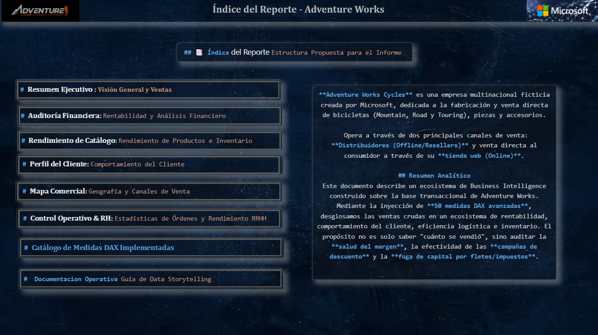
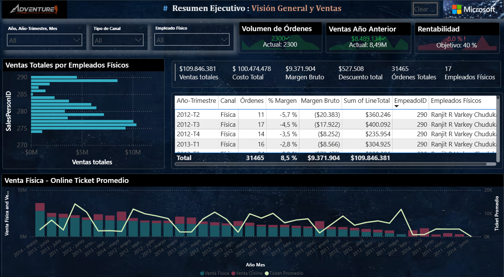
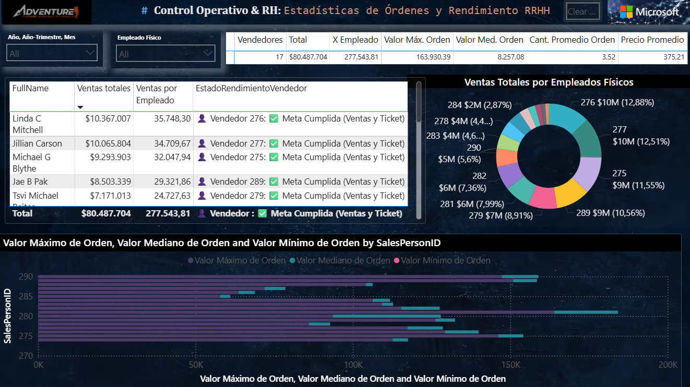

# Adventure-Works-Dashboard-BI-DEMO

## 1. Resumen del Proyecto
El proyecto **Adventure Works BI** implementa un ecosistema analítico avanzado sobre la base transaccional de una empresa multinacional dedicada a la manufactura y distribución de bicicletas.  
Su propósito es transformar datos crudos en información estratégica, permitiendo auditar la rentabilidad, la eficiencia logística y el desempeño comercial en tiempo real.  

Este tablero se posiciona como una herramienta clave para la toma de decisiones ejecutivas, integrando control financiero, auditoría operativa y análisis predictivo.

---

## 2. Guía de Conexión – Adventure Works BI
- Descarga y localiza la base de datos:  
  [AdventureWorks2022 – Microsoft SQL Server Samples](https://github.com/Microsoft/sql-server-samples/releases/download/adventureworks/AdventureWorks2025.bak)  
- Edita parámetros en Power BI:  
  **Inicio → Transformar datos → Editar parámetros**  
- Cambia la ruta o servidor según tu entorno.  
- Aplica los cambios, actualiza los datos y administra tus credenciales para mantener el tablero funcionando correctamente.  

---

## 3. Arquitectura del Modelo de Datos
- Modelo en **Esquema en Estrella (Star Schema)**.  
- **Tabla de hechos:** ventas y órdenes.  
- **Dimensiones:** clientes, productos, tiempo, empleados, geografía.  
- Optimizado para consultas rápidas y análisis en Power BI.  

---

## 4. Manual de Usuario
- **Hoja 1 – Resumen Ejecutivo:** KPIs de ingresos y margen bruto, comparación interanual con indicadores dinámicos.  
- **Hoja 6 – Control de Gestión y RRHH:** clasificación de vendedores con semáforo de rendimiento, evaluación de cuotas y márgenes.  
- Navega con los filtros superiores (Año, Trimestre, Mes, Canal, Empleado) para personalizar la vista.  

---

## Vista del Dashboard

## Resumen_ejecutivo

## Control de Gestión y RRHH

